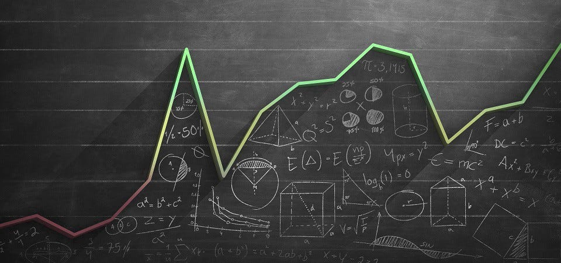
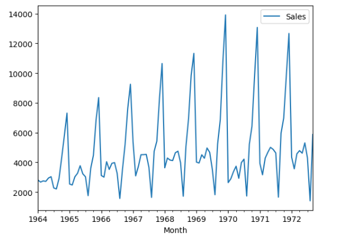
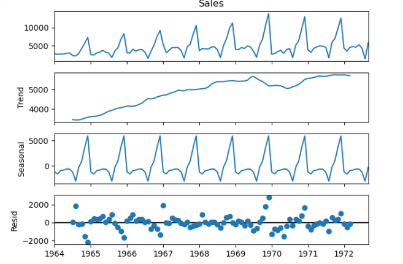
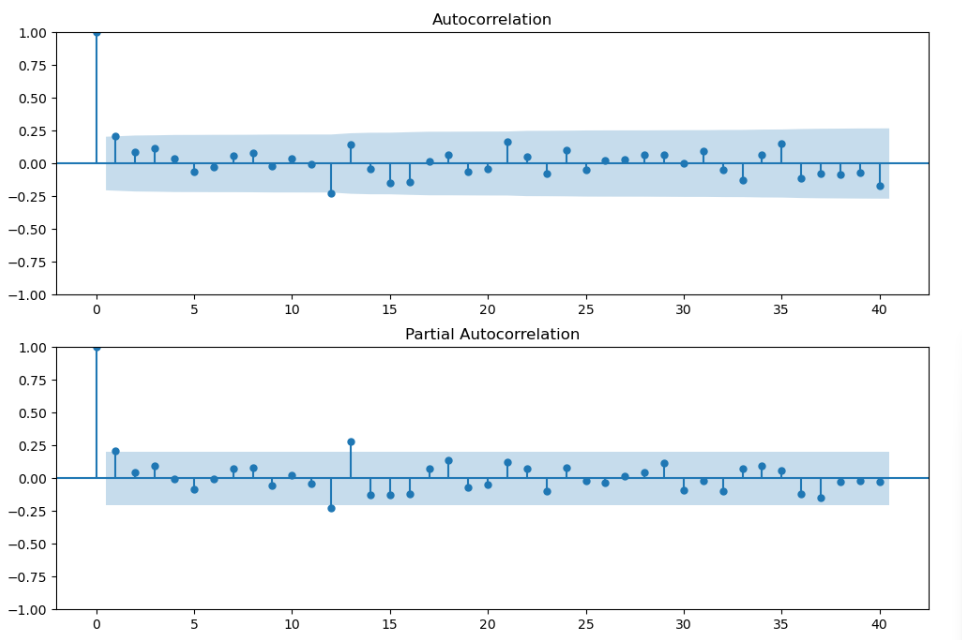
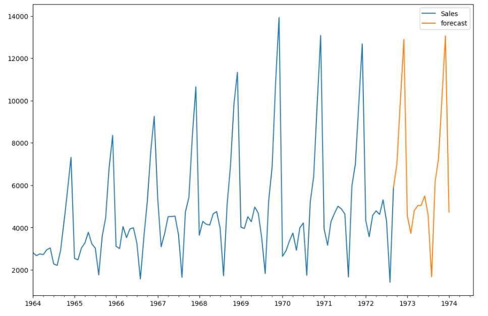

# Perrin Frères Monthly Champagne Sales Forecasting (ARIMA)


  
## Overview

This project aims to forecast monthly champagne sales for Perrin Frères using time series analysis techniques, primarily the **ARIMA (AutoRegressive Integrated Moving Average)** model. The dataset consists of historical sales data, and the objective is to build an accurate predictive model for future sales.

## Features

- Data preprocessing and time series transformation
- Exploratory Data Analysis (EDA)
- ARIMA model training and evaluation
- Forecast visualization

## Technologies Used

- Python
- Jupyter Notebook
- Pandas, NumPy
- Statsmodels
- Matplotlib, Seaborn

## Installation

1. Clone the repository:
   ```bash
   git clone https://github.com/your-repo/champagne-sales-forecast.git
   ```
2. Navigate to the project directory:
   ```bash
   cd champagne-sales-forecast
   ```
3. Install dependencies:
   ```bash
   pip install -r requirements.txt
   ```

## Exploratory Data Analysis (EDA)

EDA was conducted to analyze sales trends and seasonality:

- **Sales Trend:** An increasing trend in champagne sales over time.
- **Seasonality Analysis:** Sales show a seasonal pattern, with spikes in specific months.
- **Stationarity Check:** Augmented Dickey-Fuller (ADF) test was performed to check for stationarity.
- **Moving Average & Decomposition:** Seasonal decomposition was used to separate trend, seasonality, and residual components.

### Key Visualizations

- **Time Series Plot**
  
  
- **Seasonality Decomposition**
  
  
- **ACF & PACF Plots**
  

## Model Training & Evaluation

The ARIMA model was trained using the following steps:

- **Parameter Selection:** ACF & PACF plots were analyzed to determine AR (p), I (d), and MA (q) values.
- **Model Fitting:** The ARIMA model was trained using historical data.
- **Forecast Results:** Future sales predictions were plotted alongside actual data.

### Model Performance Visualizations

- **Final Predicted Graph**
  

## Usage

1. Open the Jupyter Notebook:
   ```bash
   jupyter notebook
   ```
2. Load and run `perrin freres monthly champagne sale arima.ipynb`.
3. Follow the steps inside the notebook to preprocess data, train models, and evaluate results.

## Dataset

The dataset contains monthly champagne sales figures. Ensure the dataset is available in the appropriate location before running the notebook.

## Results

The trained ARIMA model provides accurate forecasts for champagne sales, capturing seasonality and trends effectively. Evaluation metrics such as RMSE and AIC confirm the model's reliability in predicting future sales.

## Contributions

Contributions are welcome! Feel free to open issues or submit pull requests.

## Contact

For any queries, reach out to suyashbargal@gmail.com

